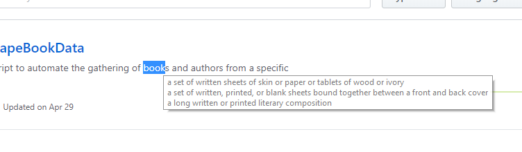

# Dictionary
A Chrome extension that allows the user to highlight any word, which triggers the definition(s) to be displayed.

The definition is displayed as a tooltip and disappears when the text is unselected.
Each line of the tooltip is another definition of the word.

